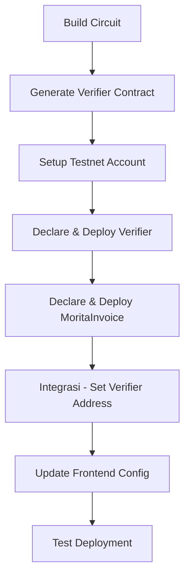

# Deployment Plan: Verifier & MoritaInvoice ke Testnet

Dokumen ini berisi langkah-langkah detail untuk men-deploy Verifier contract dan MoritaInvoice contract ke Starknet Testnet (Sepolia/Alpha).

---

## Prasyarat

### 1. Tools yang perlu diinstall

Pastikan semua tools berikut sudah terinstall:

```bash
# Install Bun
make install-bun

# Install Noir (ZK Circuit)
make install-noir

# Install Barretenberg (Proving System)
make install-barretenberg

# Install Starknet CLI
make install-starknet

# Install Devnet (untuk testing lokal)
make install-devnet

# Install Garaga (verifier generation)
make install-garaga

# Install Sncast (Starknet deployment tool)
# Via starknet-foundry
curl -L https://raw.githubusercontent.com/foundry-rs/foundry/master/foundryup | bash
foundryup
cargo install starknet-foundry --profile release
```

### 2. Wallet & Account

- Siapkan wallet yang mendukung Starknet (Braavos, ArgentX, atau Keplr)
- Dapatkan testnet ETH dari [Starknet Faucet](https://sepolia.starknet.io/)
- Pastikan account memiliki minimal 0.5-1 ETH untuk deployment

---

## Alur Deployment



---

## Step 1: Build Circuit & Generate Verifier

### 1.1 Build Noir Circuit

```bash
cd smart-contract
make build-circuit
```

Expected output: `circuit/target/invoice_commitment.json`

### 1.2 Generate Witness

```bash
make exec-circuit
```

### 1.3 Generate Verification Key

```bash
make gen-vk
```

Expected output: `circuit/target/vk`

### 1.4 Generate Verifier Contract (Cairo)

```bash
make gen-verifier
```

Expected output: `contracts/verifier/src/`

---

## Step 2: Setup Testnet Account

### 2.1 Buat .env file

Buat file `smart-contract/contracts/.env`:

```bash
# Starknet Testnet RPC
STARKNET_RPC_URL="https://rpc.sepolia.starknet.io"
# atau alpha testnet
# STARKNET_RPC_URL="https://alpha4.starknet.io"

# Private key (JANGAN commit ke git!)
STARKNET_ACCOUNT_PRIVATE_KEY="0x..."

#Wallet type: braavos|argent
STARKNET_WALLET_TYPE="braavos"
```

### 2.2 Konfigurasi Sncast

Update `smart-contract/contracts/snfoundry.toml`:

```toml
[sncast.default]
url = "https://rpc.sepolia.starknet.io"
accounts-file = "./accounts.json"
account = "my_account"
show-explorer-links = true
```

### 2.3 Generate Account

```bash
cd smart-contract/contracts

# Create account baru (akan generate keys dan account.json)
sncast account create --name my_account --wallet starknet-braavos

# Atau menggunakan existing account
sncast account import --name my_account --private-key 0x...
```

### 2.4 Declare & Fund

```bash
# Check balance
sncast account balance --account my_account

# Jika perlu ETH, cek faucet: https://sepolia.starknet.io/
```

---

## Step 3: Deploy Verifier Contract

### 3.1 Build Verifier Contract

```bash
cd smart-contract
make build-verifier
```

### 3.2 Declare Verifier

```bash
cd smart-contract/contracts
sncast declare --contract-name UltraStarknetHonkVerifier --package verifier --account my_account
```

**Catat class hash** dari output, contoh:

```
Class hash: 0x1234...5678abcdef
```

### 3.3 Deploy Verifier

```bash
sncast deploy --class-hash 0x1234...5678abcdef --salt 0x0 --account my_account
```

**Catat verifier address**, contoh:

```
Contract address: 0xabcd...1234
```

---

## Step 4: Deploy MoritaInvoice Contract

### 4.1 Siapkan Parameter Deployment

MoritaInvoice constructor membutuhkan:

| Parameter           | Tipe            | Deskripsi                    |
| ------------------- | --------------- | ---------------------------- |
| `owner`             | ContractAddress | Owner/admin contract         |
| `fee_collector`     | ContractAddress | Wallet untuk kumpulkan fee   |
| `strk_token`        | ContractAddress | Alamat STRK token di testnet |
| `verifier_contract` | ContractAddress | Alamat verifier contract     |

### 4.2 Dapatkan STRK Token Address (Testnet)

Cek alamat STRK di testnet:

- **Sepolia**: `0x...` (cek di Starknet explorer)
- Atau gunakan ETH sebagai alternatif (modify contract)

### 4.3 Deploy MoritaInvoice

```bash
cd smart-contract/contracts

# Format: sncast deploy --constructor-calldata "<param1>,<param2>,<param3>,<param4>" --account my_account

# Contoh (sesuaikan dengan addresses yang sebenarnya):
sncast deploy \
  --class-hash <morita_class_hash> \
  --salt 0x1 \
  --constructor-calldata "<owner_address>,<fee_collector_address>,<strk_token_address>,<verifier_address>" \
  --account my_account
```

**Catat morita_invoice address**, contoh:

```
Contract address: 0xdef0...5678
```

---

## Step 5: Integrasi Verifier ↔ MoritaInvoice

### 5.1 Integration Flow

```
┌─────────────────┐     verify_ultra_starknet_honk_proof()    ┌─────────────────┐
│                 │  ───────────────────────────────────────►  │                 │
│  MoritaInvoice  │                                          │    Verifier     │
│    Contract     │  ◄──────────────────────────────────────  │    Contract     │
│                 │         Option<Span<u256>> (public inputs) │                 │
└─────────────────┘                                          └─────────────────┘
```

### 5.2 Cara Integrasi

Integrasi sudah **built-in** dalam [`morita_invoice.cairo`](contracts/morita_invoice/src/morita_invoice.cairo:102):

1. **Pada saat `pay_invoice()`** - contract akan memanggil verifier untuk validasi ZK proof
2. **Pada saat `verify_invoice_claim()`** - bisa pre-verify invoice sebelum payment

Kode integrasi (sudah ada di line 102-122):

```cairo
let verifier = IVerifierDispatcher { contract_address: self.verifier_contract.read() };
let result = verifier.verify_ultra_starknet_honk_proof(merged.span());
assert(result.is_some(), MoritaInvoiceErrors::PAYMENT_PROOF_INVALID);
```

### 5.3 Verify Integration

Setelah kedua contract di-deploy:

```bash
# Cek verifier address di MoritaInvoice
sncast call \
  --contract-address <morita_invoice_address> \
  --function "verifier_contract" \
  --account my_account
```

---

## Step 6: Update Frontend Configuration

### 6.1 Update Verifier Constants

Edit [`frontend/src/constants/verifier.ts`](frontend/src/constants/verifier.ts):

```typescript
export const VERIFIER_ADDRESS = "0x..."; // Alamat verifier contract
```

### 6.2 Update Contract Address

Edit [`frontend/src/constants/index.ts`](frontend/src/constants/index.ts):

```typescript
export const MORITA_INVOICE_ADDRESS = "0x..."; // Alamat MoritaInvoice contract
```

### 6.3 Copy Artifacts

```bash
make artifacts
```

Ini akan meng-copy:

- `invoice_commitment.json` → `frontend/src/constants/assets/`
- `vk.bin` → `frontend/src/constants/assets/`
- `verifier.json` → `frontend/src/constants/assets/`

---

## Step 7: Testing

### 7.1 Testnet Explorer

Buka [Starknet Scan Sepolia](https://sepolia.starkscan.co/) untuk:

- Verify contract deployment
- View transaction history
- Check contract interactions

### 7.2 Manual Testing Checklist

- [ ] Verifier contract berhasil di-deploy dan bisa menerima verify calls
- [ ] MoritaInvoice contract berhasil di-deploy dengan verifier address yang benar
- [ ] Frontend bisa connect ke wallet dan membaca contract addresses
- [ ] Create invoice function bekerja
- [ ] Pay invoice dengan ZK proof berfungsi
- [ ] Cancel invoice berfungsi

### 7.3 Sample Test Commands

```bash
# Create Invoice
sncast invoke \
  --contract-address <morita_address> \
  --function "create_invoice" \
  --calldata "<invoice_hash>,<payee>,<client>,<amount>,<due_date>" \
  --account my_account

# Get Invoice Status
sncast call \
  --contract-address <morita_address> \
  --function "get_invoice_status" \
  --calldata "<invoice_hash>"
```

---

## Deployment Summary Sheet

| Step | Item                 | Command/Action                                           | Output             |
| ---- | -------------------- | -------------------------------------------------------- | ------------------ |
| 1    | Build Circuit        | `make build-circuit && make gen-vk && make gen-verifier` | `verifier/src/`    |
| 2    | Setup Account        | `sncast account create`                                  | `accounts.json`    |
| 3    | Deploy Verifier      | `sncast declare && sncast deploy`                        | `VERIFIER_ADDR`    |
| 4    | Deploy MoritaInvoice | `sncast deploy --constructor-calldata ...`               | `MORITA_ADDR`      |
| 5    | Verify Integration   | `sncast call verifier_contract`                          | Address match      |
| 6    | Update Frontend      | Edit `constants/verifier.ts`, `constants/index.ts`       | Config updated     |
| 7    | Test                 | Manual via frontend/explorer                             | All functions work |

---

## Troubleshooting

### Common Issues

1. **Insufficient balance**
   - Solution: Dapatkan lebih banyak ETH dari faucet

2. **Class hash mismatch**
   - Solution: Pastikan declare dan deploy menggunakan class hash yang sama

3. **Constructor calldata error**
   - Solution: Gunakan format yang benar untuk felt252 dan ContractAddress

4. **ZK Proof verification failed**
   - Solution: Pastikan proof di-generate dengan circuit yang sama (VK harus match)

5. **Version mismatch**
   - Solution: Pastikan versi Noir, Barretenberg, dan Garaga sesuai:
     - Noir: 1.0.0-beta.6
     - Barretenberg: 0.86.0-starknet.1
     - Garaga: 0.18.1

---

## Useful Links

- [Starknet Docs](https://docs.starknet.io/)
- [Sncast Guide](https://foundry-rs.github.io/starknet-foundry/starknet/101.html)
- [Starknet Scan (Sepolia)](https://sepolia.starkscan.co/)
- [Starknet Faucet](https://sepolia.starknet.io/)
- [Garaga Documentation](https://garaga.gitbook.io/garaga/)

---

**Last Updated**: 2026-03-10
