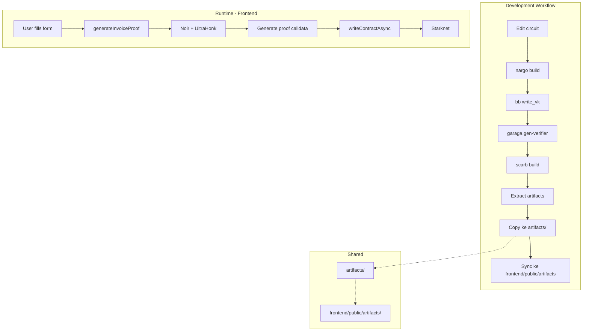

# Morita Protocol Monorepo Setup Plan

## Executive Summary

Dokumen ini contains detailed execution plan untuk convert Morita Protocol menjadi monorepo dengan independent installations, shared artifacts folder, dan efficient ZK development workflow untuk hackathon.

---

## 1. Current State Analysis

### 1.1 Existing Structure

```
morita-protocol/
├── frontend/              # Next.js 16 + Tailwind + TypeScript ✓
│   ├── src/
│   │   ├── app/           # Routes: home, create, history, pay
│   │   ├── components/    # Modular UI components
│   │   ├── hooks/
│   │   └── lib/
│   ├── public/
│   └── package.json       # No ZK dependencies yet
├── smart-contract/        # Garaga scaffold + Vite demo
│   ├── circuit/           # Noir circuit template
│   │   ├── src/main.nr    # Dummy circuit (x != y)
│   │   └── Nargo.toml
│   ├── contracts/         # Cairo contracts
│   │   └── verifier/      # Generated verifier contract
│   ├── app/               # Vite demo (reference only)
│   ├── Makefile           # Build scripts
│   └── README.md
├── docs/
├── prd/
├── template/
└── tasks/
```

### 1.2 Dependencies Analysis

| Workspace         | Current Dependencies                           | Missing for ZK                           |
| ----------------- | ---------------------------------------------- | ---------------------------------------- |
| `frontend/`       | next, react, @starknet-react/core, tailwindcss | @noir-lang/noir_js, @aztec/bb.js, garaga |
| `smart-contract/` | bun (in app/), starknet tools                  | N/A - already has ZK tools               |

### 1.3 Identified Issues

1. **No shared artifacts folder** - artifacts scattered di `app/src/assets/`
2. **No ZK dependencies di frontend** - can't generate proofs client-side
3. **No zk.ts library** - missing abstraction for proof generation
4. **Vite demo tidak terintegrasi** dengan frontend Next.js

---

## 2. Target Monorepo Structure

### 2.1 Folder Structure Diagram

```
morita-protocol/
├── frontend/                          # Next.js 16 (Independent install)
│   ├── src/
│   │   ├── app/
│   │   │   ├── create/page.tsx       # ← Modif: Add ZK proof gen
│   │   │   ├── pay/page.tsx
│   │   │   └── ...
│   │   ├── components/               # Existing modules
│   │   ├── lib/
│   │   │   └── zk.ts                # ← NEW: ZK proof library
│   │   └── ...
│   ├── public/
│   │   ├── artifacts/               # ← SYMLINK/COPY dari root artifacts/
│   │   │   ├── circuit.json
│   │   │   ├── vk.bin
│   │   │   └── verifier.json
│   │   └── ...
│   ├── package.json                  # ← Modif: Add ZK deps
│   └── bun.lock
├── smart-contract/                    # Noir + Cairo (Independent install)
│   ├── circuit/                       # Noir ZK circuit
│   │   ├── src/main.nr               # ← Modif: Invoice logic
│   │   ├── Nargo.toml
│   │   ├── Prover.toml
│   │   └── target/                   # Auto-generated artifacts
│   │       ├── circuit.json
│   │       ├── witness.gz
│   │       ├── vk
│   │       └── proof
│   ├── contracts/                     # Cairo verifier contracts
│   │   ├── verifier/
│   │   │   └── target/               # Deployable verifier
│   │   ├── Scarb.toml
│   │   └── snfoundry.toml
│   ├── app/                           # Vite demo (REFERENCE ONLY)
│   │   └── ...
│   ├── .env                           # Environment variables
│   ├── Makefile                       # ← Modif: Add copy targets
│   └── README.md
├── artifacts/                         # ← NEW: Shared artifacts (gitkeep only)
│   ├── circuit.json                   # Binary circuit definition
│   ├── vk.bin                         # Verification key
│   └── verifier.json                  # Cairo verifier ABI
├── .env.example                       # ← NEW: Env template
├── .gitignore                         # ← Modif: Add artifacts
└── README.md
```

### 2.2 Data Flow Diagram



---

## 3. Files to Create/Modify/Delete

### 3.1 NEW Files

| File                       | Location | Purpose                      |
| -------------------------- | -------- | ---------------------------- |
| `frontend/src/lib/zk.ts`   | NEW      | ZK proof generation library  |
| `artifacts/.gitkeep`       | NEW      | Keep artifacts folder in git |
| `.env.example`             | NEW      | Environment template         |
| `frontend/src/types/zk.ts` | NEW      | TypeScript interfaces for ZK |

### 3.2 MODIFY Files

| File                               | Changes                                       |
| ---------------------------------- | --------------------------------------------- |
| `frontend/package.json`            | Add: @noir-lang/noir_js, @aztec/bb.js, garaga |
| `frontend/src/app/create/page.tsx` | Add: ZK proof generation call                 |
| `frontend/next.config.ts`          | Add: WASM handling config                     |
| `smart-contract/Makefile`          | Add: copy-to-artifacts targets                |
| `.gitignore`                       | Add: artifacts/, circuit/target               |

### 3.3 DELETE Files (Optional)

| File                         | Reason                           |
| ---------------------------- | -------------------------------- |
| `smart-contract/app/`        | No longer needed after migration |
| `frontend/public/file.svg`   | Unused default assets            |
| `frontend/public/globe.svg`  | Unused default assets            |
| `frontend/public/next.svg`   | Unused default assets            |
| `frontend/public/vercel.svg` | Unused default assets            |
| `frontend/public/window.svg` | Unused default assets            |

---

## 4. Step-by-Step Execution Plan

### Phase 1: Foundation Setup

#### Step 1.1: Create Artifacts Folder

```bash
# Di root morita-protocol/
cd c:/Users/aryhi/OneDrive/Desktop/Blockchain\ Projects/morita-protocol

# Create artifacts directory
mkdir -p artifacts

# Create .gitkeep to track folder in git
echo "# Auto-generated ZK artifacts - DO NOT EDIT" > artifacts/.gitkeep
echo "circuit.json" >> artifacts/.gitkeep
echo "vk.bin" >> artifacts/.gitkeep
echo "verifier.json" >> artifacts/.gitkeep

# Verify
ls -la artifacts/
```

#### Step 1.2: Update .gitignore

Tambahkan di root `.gitignore`:

```gitignore
# ZK Artifacts (generated)
artifacts/*
!artifacts/.gitkeep

# Circuit build outputs
circuit/target/
contracts/*/target/
```

### Phase 2: Build Circuit & Generate Artifacts

#### Step 2.1: Build Noir Circuit

```bash
cd smart-contract/circuit

# Build circuit
nargo build

# Verify output
ls -la target/
```

#### Step 2.2: Generate Verification Key

```bash
cd smart-contract

# Generate VK using bb
bb write_vk --scheme ultra_honk --oracle_hash starknet -b ./circuit/target/circuit.json -o ./circuit/target

# Verify
ls -la circuit/target/vk
```

#### Step 2.3: Generate Cairo Verifier Contract

```bash
cd smart-contract/contracts

# Generate verifier
garaga gen --system ultra_starknet_honk --vk ../circuit/target/vk --project-name verifier

# Build verifier contract
cd verifier

# Check dependencies first
cat Scarb.toml

# Build
scarb build

# Verify output
ls -la target/release/
```

#### Step 2.4: Extract Artifacts

```bash
cd smart-contract

# Extract and place in app/assets (existing flow)
cp ./circuit/target/circuit.json ./app/src/assets/circuit.json
cp ./circuit/target/vk ./app/src/assets/vk.bin
cp ./contracts/verifier/target/release/verifier_UltraStarknetHonkVerifier.contract_class.json ./app/src/assets/verifier.json

# NEW: Copy to root artifacts folder
cp ./circuit/target/circuit.json ../artifacts/
cp ./circuit/target/vk ../artifacts/vk.bin
cp ./contracts/verifier/target/release/verifier_UltraStarknetHonkVerifier.contract_class.json ../artifacts/verifier.json

# Verify
ls -la ../artifacts/
```

### Phase 3: Frontend ZK Dependencies

#### Step 3.1: Install ZK Dependencies

```bash
cd frontend

# Install Noir JS for proof generation in browser
bun add @noir-lang/noir_js

# Install Barretenberg backend
bun add @aztec/bb.js

# Install Garaga for Starknet integration
bun add garaga

# Install Starknet dependencies (if not already)
bun add starknet @starknet-react/core @starknet-react/chains

# Verify installation
cat package.json | grep -E "(noir_js|bb.js|garaga|starknet)"
```

#### Step 3.2: Update package.json

Final `frontend/package.json` dependencies section:

```json
{
  "dependencies": {
    "next": "16.1.6",
    "react": "19.2.3",
    "react-dom": "19.2.3",
    "@starknet-react/core": "^0.22.0",
    "@starknet-react/chains": "^0.22.0",
    "starknet": "^6.11.0",
    "@noir-lang/noir_js": "^1.0.0-beta.6",
    "@aztec/bb.js": "^0.86.0-starknet.1",
    "garaga": "^0.18.1",
    "tailwindcss": "^4",
    "lucide-react": "^0.553.0",
    "clsx": "^2.1.1"
  }
}
```

### Phase 4: Create ZK Library

#### Step 4.1: Create frontend/src/lib/zk.ts

```typescript
/**
 * ZK Proof Generation Library
 * Uses Noir + UltraHonk backend + Garaga untuk Starknet integration
 *
 * Prerequisites:
 * - circuit.json from smart-contract/circuit/target/
 * - vk.bin from smart-contract/circuit/target/
 * - verifier.json from smart-contract/contracts/verifier/target/release/
 */

import { Noir } from "@noir-lang/noir_js";
import { UltraHonkBackend } from "@aztec/bb.js";
import { getHonkCallData, init } from "garaga";

// Type imports from artifacts
interface NoirCircuit {
  bytecode: string;
  abi: any;
}

interface ProofResult {
  proof: Uint8Array;
  publicInputs: string[];
  callData: string[];
}

interface PrivateInputs {
  encryptionKey: string;
  clientNameHash: string;
  descriptionHash: string;
}

interface PublicInputs {
  amount: string;
  freelancerAddress: string;
  clientAddress: string;
}

// Lazy-loaded artifacts
let _circuitJson: NoirCircuit | null = null;
let _verifierAbi: any = null;
let _vk: Uint8Array | null = null;

async function getArtifacts() {
  if (_circuitJson && _verifierAbi && _vk) {
    return { circuit: _circuitJson, verifierAbi: _verifierAbi, vk: _vk };
  }

  const [circuitRes, verifierRes, vkRes] = await Promise.all([
    fetch("/artifacts/circuit.json"),
    fetch("/artifacts/verifier.json"),
    fetch("/artifacts/vk.bin"),
  ]);

  _circuitJson = await circuitRes.json();
  _verifierAbi = await verifierRes.json();
  _vk = new Uint8Array(await vkRes.arrayBuffer());

  return { circuit: _circuitJson!, verifierAbi: _verifierAbi!, vk: _vk! };
}

export async function generateInvoiceProof(
  privateInputs: PrivateInputs,
  publicInputs: PublicInputs,
): Promise<ProofResult> {
  try {
    // Step 1: Initialize Garaga
    await init();

    // Step 2: Load artifacts
    const { circuit, verifierAbi, vk } = await getArtifacts();

    // Step 3: Prepare witness inputs
    const witnessInput = {
      private_inputs: {
        encryption_key: { inner: parseInt(privateInputs.encryptionKey, 16) },
        client_name_hash: { inner: parseInt(privateInputs.clientNameHash, 16) },
        description_hash: {
          inner: parseInt(privateInputs.descriptionHash, 16),
        },
      },
      public_inputs: {
        amount: { inner: parseInt(publicInputs.amount, 16) },
        freelancer_address: {
          inner: parseInt(publicInputs.freelancerAddress, 16),
        },
        client_address: { inner: parseInt(publicInputs.clientAddress, 16) },
      },
    };

    // Step 4: Generate witness using Noir
    const noir = new Noir({
      bytecode: Uint8Array.from(Buffer.from(circuit.bytecode, "hex")),
      abi: circuit.abi,
    });

    const execResult = await noir.execute(witnessInput);

    // Step 5: Generate UltraHonk proof
    const backend = new UltraHonkBackend(
      Uint8Array.from(Buffer.from(circuit.bytecode, "hex")),
      {
        threads:
          typeof navigator !== "undefined"
            ? navigator.hardwareConcurrency || 4
            : 4,
      },
    );

    const proof = await backend.generateProof(execResult.witness, {
      starknet: true,
    });

    // Cleanup backend
    backend.destroy();

    // Step 6: Convert to Starknet calldata using Garaga
    const callData = getHonkCallData(
      proof.proof,
      [
        publicInputs.amount,
        publicInputs.freelancerAddress,
        publicInputs.clientAddress,
      ],
      vk,
      1, // STARKNET flavor
    );

    return {
      proof: proof.proof,
      publicInputs: proof.publicInputs,
      callData: callData,
    };
  } catch (error) {
    console.error("Error generating ZK proof:", error);
    throw error;
  }
}

export function hashKeccak256(data: string): string {
  // Simplified - in production use proper Keccak256
  const crypto = require("crypto");
  return "0x" + crypto.createHash("sha3-256").update(data).digest("hex");
}
```

#### Step 4.2: Create artifacts folder in frontend

```bash
cd frontend/public

# Create symlink (works on most systems)
mklink /D artifacts ..\..\artifacts

# If symlink fails on Windows, use copy instead
# mkdir -p artifacts
# cp ../../artifacts/* artifacts/
```

### Phase 5: Update Create Page

#### Step 5.1: Modify frontend/src/app/create/page.tsx

```typescript
"use client";

import { useState } from "react";
import { useAccount, useWriteContract } from "@starknet-react/core";
import { generateInvoiceProof, hashKeccak256 } from "@/lib/zk";

// Constants from environment
const VERIFIER_ADDRESS = process.env.NEXT_PUBLIC_VERIFIER_ADDRESS!;

export default function CreateInvoicePage() {
  const { address: freelancerAddress } = useAccount();
  const { writeContractAsync } = useWriteContract();
  const [isProcessing, setIsProcessing] = useState(false);

  const [formData, setFormData] = useState({
    clientAddress: "",
    clientName: "",
    description: "",
    amount: "",
    dueDate: "",
  });

  const handleSubmit = async (e: React.FormEvent) => {
    e.preventDefault();

    if (!freelancerAddress) {
      alert("Please connect wallet first");
      return;
    }

    setIsProcessing(true);

    try {
      // Step 1: Generate encryption key
      const encryptionKey = crypto.randomUUID();

      // Step 2: Hash private data
      const clientNameHash = hashKeccak256(formData.clientName);
      const descriptionHash = hashKeccak256(formData.description);

      // Step 3: Generate ZK proof
      const { callData } = await generateInvoiceProof(
        {
          encryptionKey,
          clientNameHash,
          descriptionHash,
        },
        {
          amount: formData.amount,
          freelancerAddress,
          clientAddress: formData.clientAddress,
        },
      );

      // Step 4: Deploy to blockchain
      const { transaction_hash } = await writeContractAsync({
        contractAddress: VERIFIER_ADDRESS,
        functionName: "create_invoice",
        calldata: callData,
      });

      // Step 5: Generate secure URL
      const invoiceId = extractInvoiceId(transaction_hash);
      const secureUrl = `/pay?id=${invoiceId}&key=${encryptionKey}`;

      window.location.href = secureUrl;
    } catch (error) {
      console.error("Error creating invoice:", error);
      alert("Failed to create invoice. See console for details.");
    } finally {
      setIsProcessing(false);
    }
  };

  // ... rest of component (form UI)
}
```

### Phase 6: Update Makefile

#### Step 6.1: Modify smart-contract/Makefile

Tambahkan di akhir makefile:

```makefile
# ======================================================
# ARTIFACT MANAGEMENT
# ======================================================

# Copy all necessary artifacts to root artifacts folder
update-artifacts:
	@echo "Updating shared artifacts folder..."
	cp ./circuit/target/circuit.json ../artifacts/
	cp ./circuit/target/vk ../artifacts/vk.bin
	cp ./contracts/verifier/target/release/verifier_UltraStarknetHonkVerifier.contract_class.json ../artifacts/verifier.json
	@echo "Artifacts updated in ../artifacts/"

# Copy artifacts to frontend public folder
copy-to-frontend:
	@echo "Copying artifacts to frontend..."
	cp ./circuit/target/circuit.json ../../frontend/public/artifacts/
	cp ./circuit/target/vk ../../frontend/public/artifacts/vk.bin
	cp ./contracts/verifier/target/release/verifier_UltraStarknetHonkVerifier.contract_class.json ../../frontend/public/artifacts/verifier.json
	@echo "Artifacts copied to frontend/public/artifacts/"

# Full build + sync
sync: build-circuit gen-vk gen-verifier build-verifier update-artifacts copy-to-frontend
	@echo "Full sync complete!"

# Clean all build artifacts
clean-all:
	rm -rf ./circuit/target/*
	rm -rf ./contracts/*/target/*
	rm -f ../artifacts/*
	rm -f ../../frontend/public/artifacts/*
```

---

## 5. Dependencies Matrix

### 5.1 Root Folder Level

| Tool | Version | Purpose         | Install Command                     |
| ---- | ------- | --------------- | ----------------------------------- |
| bun  | latest  | Package manager | `curl -fsSL https://bun.sh/install` |
| git  | latest  | Version control | Pre-installed                       |

### 5.2 Smart-Contract Workspace

| Tool            | Version           | Purpose                  | Install Command                                              |
| --------------- | ----------------- | ------------------------ | ------------------------------------------------------------ | --- |
| nargo           | 1.0.0-beta.6      | Noir compiler            | `noirup --version 1.0.0-beta.6`                              |
| bb              | 0.86.0-starknet.1 | Barretenberg prover      | `bbup --version 0.86.0-starknet.1`                           |
| scarb           | 2.5.0             | Cairo package manager    | `curl --proto '=https' --tlsv1.2 -sSf https://sh.starkup.dev | sh` |
| sncast          | latest            | Starknet CLI             | Included in starkup                                          |
| garaga          | 0.18.1            | Cairo verifier generator | `pip install garaga==0.18.1`                                 |
| starknet-devnet | 0.4.2             | Local testing            | `asdf install starknet-devnet 0.4.2`                         |

### 5.3 Frontend Workspace

| Package                | Version            | Purpose                   |
| ---------------------- | ------------------ | ------------------------- |
| next                   | 16.1.6             | React framework           |
| react                  | 19.2.3             | UI library                |
| @starknet-react/core   | ^0.22.0            | Starknet wallet hooks     |
| @starknet-react/chains | ^0.22.0            | Starknet chain configs    |
| starknet               | ^6.11.0            | Starknet SDK              |
| @noir-lang/noir_js     | ^1.0.0-beta.6      | Noir proof generation     |
| @aztec/bb.js           | ^0.86.0-starknet.1 | UltraHonk backend         |
| garaga                 | ^0.18.1            | ZK + Starknet integration |
| tailwindcss            | ^4                 | CSS framework             |
| lucide-react           | ^0.553.0           | Icons                     |
| clsx                   | ^2.1.1             | Utility for class names   |

---

## 6. Execution Timeline

### Day 1: Foundation

| Time  | Task                               | Duration |
| ----- | ---------------------------------- | -------- |
| 00:00 | Create artifacts folder & .gitkeep | 5 min    |
| 00:05 | Update root .gitignore             | 5 min    |
| 00:10 | Verify smart-contract tools        | 15 min   |
| 00:25 | Build circuit with Nargo           | 10 min   |
| 00:35 | Generate VK and verifier           | 15 min   |
| 00:50 | Extract artifacts to shared folder | 10 min   |

### Day 2: Frontend Integration

| Time  | Task                                | Duration |
| ----- | ----------------------------------- | -------- |
| 00:00 | Install ZK dependencies in frontend | 10 min   |
| 00:10 | Create symlink/copy artifacts       | 5 min    |
| 00:15 | Create zk.ts library                | 30 min   |
| 00:45 | Test ZK proof generation            | 20 min   |
| 01:05 | Update create/page.tsx              | 15 min   |
| 01:20 | End-to-end test                     | 30 min   |

### Day 3: Polish & Automation

| Time  | Task                        | Duration |
| ----- | --------------------------- | -------- |
| 00:00 | Update Makefile targets     | 10 min   |
| 00:10 | Test Makefile sync commands | 10 min   |
| 00:20 | Document env vars           | 10 min   |
| 00:30 | Cleanup unused files        | 15 min   |
| 00:45 | Final integration test      | 30 min   |

**Total Estimated Time: ~2-3 hours**

---

## 7. Environment Configuration

### 7.1 Root .env.example

```env
# ============================================
# Environment Variables Template
# Copy to .env and fill in values
# ============================================

# Starknet Network
STARKNET_RPC_URL=https://starknet-sepolia.public.blastapi.io/rpc/v0_7
STARKNET_ACCOUNT_ADDRESS=0x...
STARKNET_PRIVATE_KEY=0x...

# Frontend Only
NEXT_PUBLIC_STARKNET_RPC_URL=https://starknet-sepolia.public.blastapi.io/rpc/v0_7
NEXT_PUBLIC_VERIFIER_ADDRESS=0x...
NEXT_PUBLIC_INVOICE_CONTRACT_ADDRESS=0x...
```

### 7.2 Frontend .env.local

```env
NEXT_PUBLIC_STARKNET_RPC_URL=https://starknet-sepolia.public.blastapi.io/rpc/v0_7
NEXT_PUBLIC_VERIFIER_ADDRESS=0x061dac032f228abef9c6626f995015233097ae253a7f72d68552db02f2971b8f
```

### 7.3 Smart-Contract .env

```env
STARKNET_RPC_URL=https://starknet-sepolia.public.blastapi.io/rpc/v0_7
```

---

## 8. Troubleshooting Quick Reference

| Issue                    | Solution                                                 |
| ------------------------ | -------------------------------------------------------- |
| Module not found         | `cd frontend && bun add @noir-lang/noir_js`              |
| WASM errors              | Add WASM init in layout.tsx (see docs/monerepo-setup.md) |
| Artifacts not found      | Verify `/public/artifacts/` folder exists                |
| vk.bin import failed     | Fetch as ArrayBuffer, not JSON                           |
| Garaga not found         | `pip install garaga==0.18.1`                             |
| Symlink fails on Windows | Use `mklink /D` or copy instead                          |

---

## 9. Verification Checklist

After completing setup, verify:

- [ ] `ls artifacts/` shows circuit.json, vk.bin, verifier.json
- [ ] Frontend loads `http://localhost:3000/artifacts/circuit.json`
- [ ] `frontend/package.json` includes ZK dependencies
- [ ] `frontend/src/lib/zk.ts` exists and imports correctly
- [ ] `make sync` works from smart-contract folder
- [ ] Dev server starts: `cd frontend && bun run dev`

---

## 10. Next Steps

After this plan is approved and executed:

1. Implement invoice logic in `smart-contract/circuit/src/main.nr`
2. Deploy verifier to Starknet Sepolia testnet
3. Update `NEXT_PUBLIC_VERIFIER_ADDRESS` in frontend/.env.local
4. Test complete invoice creation flow
5. (Optional) Setup GitHub Actions for CI/CD

---

**Document Version:** 1.0  
**Last Updated:** 2026-03-08  
**Status:** Ready for Review
