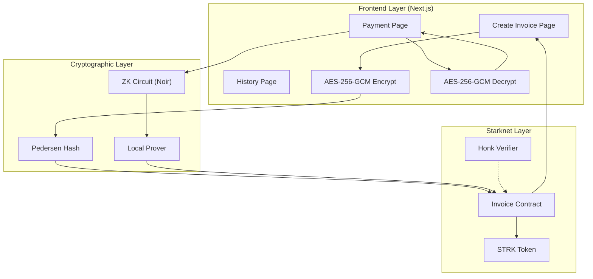
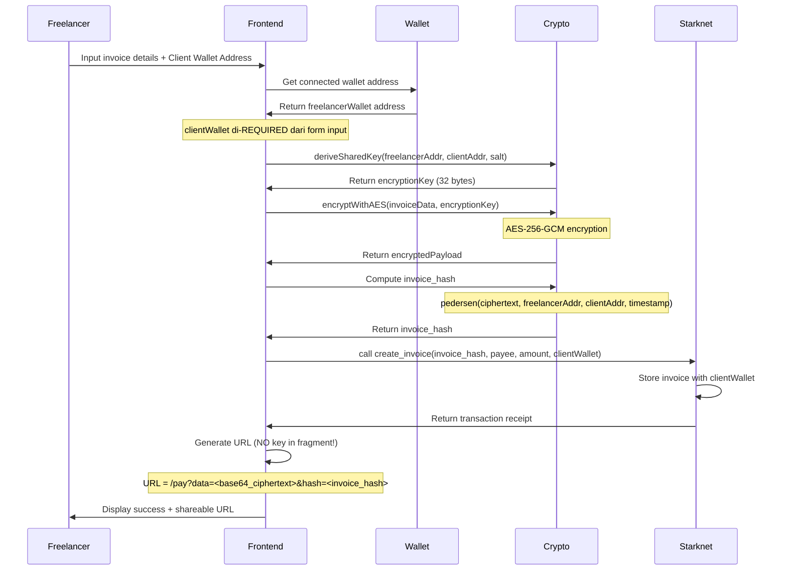
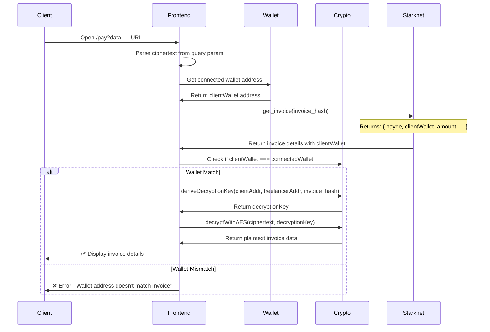
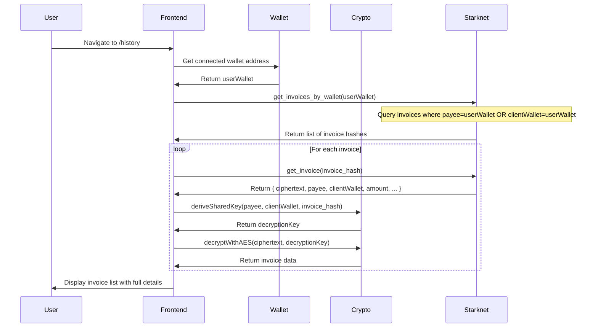
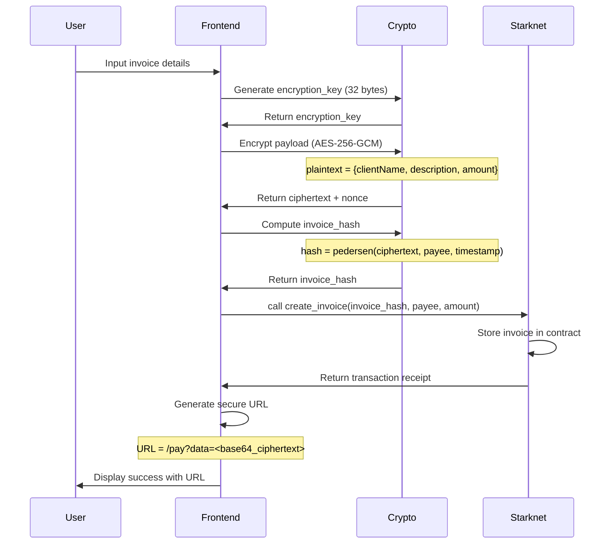
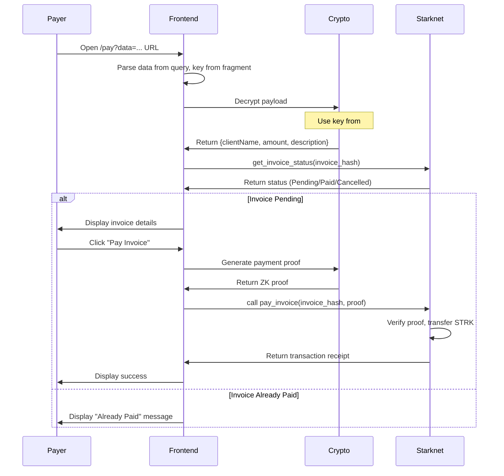

# ZK & Smart Contract Architecture - Morita Protocol

## 1. Overview & Objectives

### 1.1 Purpose

Morita Protocol adalah privacy-preserving B2B invoicing dApp di Starknet yang memungkinkan bisnis untuk membuat dan membayar invoice dengan menjaga kerahasiaan data sensitif menggunakan Zero-Knowledge Proofs (ZKP).

### 1.2 Objectives

- **Privacy**: Melindungi data invoice (client name, amount, description) dari pihak ketiga
- **Transparency**: Memvalidasi keabsahan invoice on-chain tanpa mengungkapkan detail sensitif
- **Efficiency**: Memungkinkan pembayaran seamless dengan URL-based invoice sharing
- **Security**: Menggunakan ZKP untuk memverifikasi claim tanpa mengungkapkan data asli

### 1.3 Technology Stack

| Component  | Technology       | Purpose                        |
| ---------- | ---------------- | ------------------------------ |
| ZK Circuit | Noir (Aztec)     | Generate zero-knowledge proofs |
| Verifier   | Honk (Starknet)  | On-chain proof verification    |
| Encryption | AES-256-GCM      | Client-side payload encryption |
| Blockchain | Starknet (Cairo) | Invoice state management       |
| Frontend   | Next.js          | User interface                 |

---

## 2. Frontend Integration Mapping

### 2.1 Create Invoice Page (`/create`)

| Field        | Type    | On-chain | Encrypted      | Description                 |
| ------------ | ------- | -------- | -------------- | --------------------------- |
| clientName   | string  | ❌       | ✅ AES-256-GCM | Nama klien (privacy)        |
| clientWallet | address | ✅       | ❌             | 🔐 Wallet klien (MANDATORY) |
| description  | string  | ❌       | ✅ AES-256-GCM | Deskripsi invoice           |
| amount       | u256    | ❌       | ✅ AES-256-GCM | Jumlah dalam STRK           |
| payeeWallet  | address | ✅       | ❌             | Wallet penerima (public)    |

> ⚠️ **CATATAN PENTING**: `clientWallet` adalah **WAJIB** (mandatory) dan harus di-input untuk proses key derivation. Tanpa clientWallet, invoice tidak dapat di-encrypt/decrypt dengan benar karena key derivation membutuhkan kedua address (freelancer + client).

**Flow:**

1. User input → Get freelancerWallet (connected) + clientWallet (form input - MANDATORY)
2. Derive encryption_key = deriveSharedKey(freelancerAddr, clientAddr, invoice_hash)
3. Encrypt payload → ciphertext + iv + tag
4. Compute invoice_hash = pedersen(ciphertext, payeeWallet, clientWallet, timestamp)
5. Call contract.create_invoice() dengan ciphertext, payee, clientWallet
6. Generate URL: `https://morita.io/pay?data=<base64_ciphertext>&hash=<invoice_hash>` (NO key in URL!)

### 2.2 Payment Page (`/pay`)

**URL Parsing:**

- Query param `data`: Base64-encoded encrypted payload
- Query param `hash`: Invoice hash (for fetching contract data)
- **NO key in URL** - key derived from wallet!

**Flow:**

1. Parse URL to extract `data` dan `hash`
2. Get invoice details from contract: get_invoice(hash) → returns {payee, clientWallet, amount, ...}
3. Get connected wallet address (client)
4. Verify: clientWallet === connectedWallet
5. Derive decryption_key = deriveSharedKey(payee, clientWallet, hash)
6. Decrypt payload menggunakan AES-256-GCM dengan derived key
7. Check invoice status dari contract: `get_invoice_status(invoice_hash)`
8. Display invoice details (decrypted)
9. User confirm payment → Execute STRK transfer
10. Call contract.mark_paid() dengan proof

### 2.3 Success View (`SuccessView.tsx`)

**Display:**

- Invoice ID / Hash (public)
- Payment confirmation
- Shareable URL (without key in fragment!)
- Client wallet address (for verification)

> 💡 **Tip**: URL sekarang tidak perlu menyertakan key di fragment. Client cukup connect wallet mereka untuk decrypt invoice.

---

## 3. System Architecture Diagram



### Layer Description

**Layer 1: Frontend (Client-side)**

- Input form handling
- AES-256-GCM encryption/decryption
- URL generation and parsing
- Wallet connection (Argent X / Braavos)

**Layer 2: Cryptographic**

- Noir circuit execution
- Proof generation
- Hash computation (Pedersen)
- Encryption key management

**Layer 3: Blockchain (Starknet)**

- Invoice storage and state management
- Payment processing
- ZK proof verification (Honk)
- Token transfer (STRK)

---

## 4. Smart Contract Design

### 4.1 Contract: MoritaInvoice

**Location:** `smart-contract/contracts/src/morita_invoice.cairo`

### 4.2 State Variables

```cairo
// Contract storage
struct Storage {
    // Mapping invoice hash -> Invoice struct
    invoices: LegacyMap<felt252, Invoice>,

    // Mapping invoice hash -> payment status
    invoice_status: LegacyMap<felt252, InvoiceStatus>,

    // Mapping payer -> list of paid invoice hashes
    payer_invoices: LegacyMap<(address, u32), felt252>,
    payer_invoice_count: LegacyMap<address, u32>,

    // Contract owner for admin functions
    owner: address,

    // Fee collector address
    fee_collector: address,

    // Platform fee percentage (basis points)
    fee_bps: u16,
}
```

### 4.3 Data Structures

```cairo
// Invoice status enum
enum InvoiceStatus {
    Pending: 0,
    Paid: 1,
    Cancelled: 2,
    Expired: 3,
}

// Invoice struct (stored on-chain - minimal data)
struct Invoice {
    invoice_hash: felt252,        // Pedersen hash of encrypted payload
    payee: address,                 // Wallet penerima (public)
    created_at: u64,                // Timestamp pembuatan
    due_date: u64,                  // Tanggal jatuh tempo
    amount: u256,                   // Jumlah STRK
    status: InvoiceStatus,          // Status invoice
    is_verified: bool,              // Apakah ZK proof diverifikasi
}

// Full invoice data (stored off-chain encrypted)
// - client_name: string (encrypted)
// - description: string (encrypted)
// - line_items: Array<LineItem> (encrypted)
```

### 4.4 Events

```cairo
// Event: Invoice created
@event
fn InvoiceCreated(
    invoice_hash: felt252,
    payee: address,
    amount: u256,
    created_at: u64,
) -> {}

// Event: Invoice paid
@event
fn InvoicePaid(
    invoice_hash: felt252,
    payer: address,
    amount: u256,
    paid_at: u64,
    proof_hash: felt252,
) -> {}

// Event: Invoice verified (ZK proof accepted)
@event
fn InvoiceVerified(
    invoice_hash: felt252,
    verifier: address,
    verified_at: u64,
) -> {}

// Event: Invoice cancelled
@event
fn InvoiceCancelled(
    invoice_hash: felt252,
    cancelled_by: address,
    reason: felt252,
) -> {}
```

### 4.5 Functions

#### 4.5.1 create_invoice

```cairo
fn create_invoice(
    // Public inputs
    invoice_hash: felt252,
    payee: address,
    amount: u256,
    due_date: u64,
    // Encrypted payload commitment
    payload_commitment: felt252,
) -> felt252 {
    // Validate inputs
    assert(amount > 0, 'INVALID_AMOUNT');
    assert(due_date > get_block_timestamp(), 'INVALID_DUE_DATE');

    // Store invoice
    let invoice = Invoice {
        invoice_hash,
        payee,
        created_at: get_block_timestamp(),
        due_date,
        amount,
        status: InvoiceStatus::Pending,
        is_verified: false,
    };
    invoices::write(invoice_hash, invoice);
    invoice_status::write(invoice_hash, InvoiceStatus::Pending);

    // Emit event
    InvoiceCreated(invoice_hash, payee, amount, get_block_timestamp());

    invoice_hash
}
```

#### 4.5.2 verify_invoice_claim

```cairo
fn verify_invoice_claim(
    // Public inputs
    invoice_hash: felt252,
    proof: Array<felt252>,
    public_inputs: Array<felt252>,
) -> bool {
    // Verify invoice exists
    let invoice = invoices::read(invoice_hash);
    assert(invoice.invoice_hash == invoice_hash, 'INVOICE_NOT_FOUND');

    // Call Honk verifier
    let verified = honk_verifier::verify_ultra_starknet_honk_proof(
        proof, public_inputs
    );
    assert(verified, 'PROOF_INVALID');

    // Update invoice verification status
    let mut invoice = invoices::read(invoice_hash);
    invoice.is_verified = true;
    invoices::write(invoice_hash, invoice);

    // Emit event
    InvoiceVerified(invoice_hash, get_caller_address(), get_block_timestamp());

    true
}
```

#### 4.5.3 pay_invoice

```cairo
fn pay_invoice(
    // Public inputs
    invoice_hash: felt252,
    // ZK proof for payment authorization
    payment_proof: Array<felt252>,
) -> bool {
    // Get invoice
    let invoice = invoices::read(invoice_hash);

    // Validate status
    let current_status = invoice_status::read(invoice_hash);
    assert(current_status == InvoiceStatus::Pending, 'NOT_PENDING');

    // Verify ZK proof if required
    if invoice.is_verified {
        // Already verified, skip proof check
    } else {
        // Verify payment proof
        let verified = honk_verifier::verify_ultra_starknet_honk_proof(
            payment_proof,
            array![invoice_hash, invoice.amount.into()]
        );
        assert(verified, 'PAYMENT_PROOF_INVALID');
    }

    // Calculate fees
    let fee_amount = (invoice.amount * invoice.fee_bps) / 10000;
    let payee_amount = invoice.amount - fee_amount;

    // Transfer STRK from payer to payee
    strk_token::transfer(invoice.payee, payee_amount);

    // Transfer fee to collector
    strk_token::transfer(invoice.fee_collector, fee_amount);

    // Update status
    invoice_status::write(invoice_hash, InvoiceStatus::Paid);

    // Update payer invoice count
    let caller = get_caller_address();
    let count = payer_invoice_count::read(caller);
    payer_invoices::write((caller, count), invoice_hash);
    payer_invoice_count::write(caller, count + 1);

    // Emit event
    InvoicePaid(invoice_hash, caller, invoice.amount, get_block_timestamp(),
               pedersen(payment_proof.span()));

    true
}
```

#### 4.5.4 get_invoice_status

```cairo
fn get_invoice_status(invoice_hash: felt252) -> InvoiceStatus {
    invoice_status::read(invoice_hash)
}
```

#### 4.5.5 cancel_invoice

```cairo
fn cancel_invoice(invoice_hash: felt252, reason: felt252) -> bool {
    let invoice = invoices::read(invoice_hash);

    // Only payee or owner can cancel
    let caller = get_caller_address();
    assert(caller == invoice.payee || caller == contract_owner(), 'NOT_AUTHORIZED');

    let current_status = invoice_status::read(invoice_hash);
    assert(current_status == InvoiceStatus::Pending, 'NOT_CANCELLABLE');

    invoice_status::write(invoice_hash, InvoiceStatus::Cancelled);
    InvoiceCancelled(invoice_hash, caller, reason);

    true
}
```

### 4.6 Integration Points

| Function               | External Contract  | Purpose                  |
| ---------------------- | ------------------ | ------------------------ |
| `pay_invoice`          | STRK Token (ERC20) | Transfer payment         |
| `verify_invoice_claim` | Honk Verifier      | ZK proof verification    |
| Constructor            | Account            | Set owner, fee collector |

---

## 5. Wallet-Derived Key Architecture

### 5.1 Core Concept

#### 🔐 Masalah Original Approach

❌ **Pendekatan lama** menggunakan random encryption key yang:

- Di-generate secara random menggunakan `crypto.randomBytes(32)`
- Perlu disimpan di `localStorage` atau browser
- Perlu di-share via URL fragment (kadang bermasalah)
- Jika user clear browser/localStorage, key hilang dan data tidak bisa di-decrypt

#### ✅ Solusi: Derive Key dari Wallet Addresses

Dengan arsitektur baru ini:

- 🔑 Encryption key **di-derive** dari wallet addresses (freelancer + client)
- ❌ **Tidak perlu** simpan di localStorage/browser
- 🔗 Connect wallet即可 mengakses invoice history
- 👥 Freelancer dan client **keduanya** bisa decrypt dengan addresses mereka
- 🔒 Tidak ada key yang perlu di-share via URL

#### Benefits

| Benefit                | Description                                         |
| ---------------------- | --------------------------------------------------- |
| No localStorage needed | Key derivation deterministik dari addresses         |
| Stateless              | Tidak perlu simpan state, cukup connect wallet      |
| Self-service           | Client bisa decrypt sendiri tanpa tunggu freelancer |
| Scalable               | Bisa implement history page yang aksesibel          |
| Secure                 | Tidak ada key yang transit via URL                  |

### 5.2 Key Derivation Function

#### TypeScript Implementation

```typescript
import { sha256 } from "@noble/hashes/sha256";
import { bytesToHex } from "@noble/hashes/utils";

/**
 * Derive shared encryption key dari dua wallet addresses dan salt
 * @param freelancerAddr Freelancer wallet address
 * @param clientAddr Client wallet address
 * @param salt Salt from smart contract (misal: invoice_hash atau timestamp)
 * @returns 32-byte key for AES-256-GCM
 *
 * @example
 * const key = deriveSharedKey(
 *   "0x1234567890abcdef...",
 *   "0xfedcba0987654321...",
 *   "invoice_20240309"
 * );
 * // Returns: Uint8Array(32) - deterministic based on addresses
 */
export function deriveSharedKey(
  freelancerAddr: string,
  clientAddr: string,
  salt: string,
): Uint8Array {
  // Step 1: Normalize addresses (lowercase, no 0x prefix)
  const normalizeAddr = (addr: string): string => {
    return addr.toLowerCase().replace(/^0x/, "").padStart(64, "0");
  };

  const addr1 = normalizeAddr(freelancerAddr);
  const addr2 = normalizeAddr(clientAddr);

  // Step 2: Sort addresses deterministically
  // Ini PENTING untuk memastikan: derive(A, B, salt) === derive(B, A, salt)
  const sortedAddrs = [addr1, addr2].sort();

  // Step 3: Combine dengan salt
  const input = `${sortedAddrs[0]}:${sortedAddrs[1]}:${salt}`;

  // Step 4: SHA256 untuk derive 32 bytes key
  const hashBytes = sha256(Buffer.from(input, "utf-8"));

  // Step 5: Return 32 bytes (AES-256 requires 32 bytes)
  return new Uint8Array(hashBytes.slice(0, 32));
}

/**
 * Derive encryption key dari perspective freelancer
 * Sama dengan deriveSharedKey - symmetric encryption
 *
 * @param freelancerAddr Wallet address freelancer (yang membuat invoice)
 * @param clientAddr Wallet address client
 * @param salt Salt dari contract (invoice_hash)
 */
export function deriveEncryptionKey(
  freelancerAddr: string,
  clientAddr: string,
  salt: string,
): Uint8Array {
  return deriveSharedKey(freelancerAddr, clientAddr, salt);
}

/**
 * Derive decryption key dari perspective client
 * Ini adalah fungsi yang sama dengan deriveEncryptionKey
 * karena kita menggunakan symmetric encryption (AES-256-GCM)
 *
 * @param clientAddr Wallet address client
 * @param freelancerAddr Wallet address freelancer
 * @param salt Salt dari contract (invoice_hash)
 */
export function deriveDecryptionKey(
  clientAddr: string,
  freelancerAddr: string,
  salt: string,
): Uint8Array {
  // Urutan parameter tidak masalah karena di dalam fungsi di-sort
  return deriveSharedKey(freelancerAddr, clientAddr, salt);
}

/**
 * Helper: Convert key ke hex string untuk display/logging
 */
export function keyToHex(key: Uint8Array): string {
  return bytesToHex(key);
}

/**
 * Helper: Convert hex string ke Uint8Array
 */
export function hexToKey(hex: string): Uint8Array {
  const bytes = new Uint8Array(32);
  const hexBytes = hex.replace(/^0x/, "");
  for (let i = 0; i < 32; i++) {
    bytes[i] = parseInt(hexBytes.slice(i * 2, i * 2 + 2), 16);
  }
  return bytes;
}
```

### 5.3 AES-256-GCM Implementation

#### Complete TypeScript Code

```typescript
import { randomBytes } from "@noble/hashes/utils";

// Constants
export const AES_IV_LENGTH = 12; // GCM standard: 96 bits = 12 bytes
export const AES_TAG_LENGTH = 16; // 128 bits authentication tag

/**
 * Generate random Initialization Vector (IV) untuk AES-GCM
 * @returns 12-byte random IV
 *
 * @example
 * const iv = generateIV();
 * // Returns: Uint8Array(12) - e.g., [0x12, 0x34, 0x56, ...]
 */
export function generateIV(): Uint8Array {
  return randomBytes(AES_IV_LENGTH);
}

/**
 * Interface untuk encrypted payload
 */
export interface EncryptedPayload {
  ciphertext: Uint8Array; // Encrypted data
  iv: Uint8Array; // Initialization Vector
  tag: Uint8Array; // Authentication tag
}

/**
 * Encrypt data menggunakan AES-256-GCM
 *
 * @param plaintext Data yang akan di-encrypt (string atau bytes)
 * @param key 32-byte encryption key (dari deriveSharedKey)
 * @returns EncryptedPayload { ciphertext, iv, tag }
 *
 * @example
 * const key = deriveSharedKey(freelancerAddr, clientAddr, invoiceHash);
 * const payload = await encryptWithAES(
 *   JSON.stringify({ clientName: "PT Maju", amount: "5000" }),
 *   key
 * );
 */
export async function encryptWithAES(
  plaintext: string | Uint8Array,
  key: Uint8Array,
): Promise<EncryptedPayload> {
  // Convert string ke Uint8Array jika perlu
  const plaintextBytes =
    typeof plaintext === "string"
      ? new TextEncoder().encode(plaintext)
      : plaintext;

  // Generate random IV
  const iv = generateIV();

  // Import AES-GCM key
  const cryptoKey = await crypto.subtle.importKey(
    "raw",
    key,
    { name: "AES-GCM", length: 256 },
    false,
    ["encrypt"],
  );

  // Encrypt
  const encrypted = await crypto.subtle.encrypt(
    {
      name: "AES-GCM",
      iv: iv,
      tagLength: AES_TAG_LENGTH * 8, // bits
    },
    cryptoKey,
    plaintextBytes,
  );

  // Split result: ciphertext + auth tag
  const encryptedBytes = new Uint8Array(encrypted);
  const ciphertext = encryptedBytes.slice(0, -AES_TAG_LENGTH);
  const tag = encryptedBytes.slice(-AES_TAG_LENGTH);

  return { ciphertext, iv, tag };
}

/**
 * Decrypt data menggunakan AES-256-GCM
 *
 * @param payload EncryptedPayload dari encryptWithAES
 * @param key 32-byte decryption key (dari deriveSharedKey)
 * @returns Decrypted plaintext string
 *
 * @example
 * const key = deriveSharedKey(freelancerAddr, clientAddr, invoiceHash);
 * const plaintext = await decryptWithAES(payload, key);
 * const invoiceData = JSON.parse(plaintext);
 */
export async function decryptWithAES(
  payload: EncryptedPayload,
  key: Uint8Array,
): Promise<string> {
  // Import AES-GCM key
  const cryptoKey = await crypto.subtle.importKey(
    "raw",
    key,
    { name: "AES-GCM", length: 256 },
    false,
    ["decrypt"],
  );

  // Combine ciphertext + tag untuk decrypt
  const combined = new Uint8Array(
    payload.ciphertext.length + payload.tag.length,
  );
  combined.set(payload.ciphertext, 0);
  combined.set(payload.tag, payload.ciphertext.length);

  // Decrypt
  const decrypted = await crypto.subtle.decrypt(
    {
      name: "AES-GCM",
      iv: payload.iv,
      tagLength: AES_TAG_LENGTH * 8,
    },
    cryptoKey,
    combined,
  );

  // Convert bytes ke string
  return new TextDecoder().decode(new Uint8Array(decrypted));
}

/**
 * Serialize EncryptedPayload untuk on-chain storage
 * Format: iv (12) + tag (16) + ciphertext (variable) = base64
 *
 * @param payload EncryptedPayload
 * @returns Base64 encoded string untuk URL/storage
 *
 * @example
 * const serialized = serializeEncrypted(payload);
 * // Returns: "eyJpdjOi..." - base64 string
 */
export function serializeEncrypted(payload: EncryptedPayload): string {
  // Combine all parts: IV + TAG + CIPHERTEXT
  const combined = new Uint8Array(
    payload.iv.length + payload.tag.length + payload.ciphertext.length,
  );

  let offset = 0;
  combined.set(payload.iv, offset);
  offset += payload.iv.length;
  combined.set(payload.tag, offset);
  offset += payload.tag.length;
  combined.set(payload.ciphertext, offset);

  // Convert ke base64
  return btoa(String.fromCharCode(...combined));
}

/**
 * Deserialize EncryptedPayload dari on-chain storage
 *
 * @param serialized Base64 string dari serializeEncrypted
 * @returns EncryptedPayload
 *
 * @example
 * const payload = deserializeEncrypted(serializedString);
 */
export function deserializeEncrypted(serialized: string): EncryptedPayload {
  // Decode base64
  const combined = Uint8Array.from(atob(serialized), (c) => c.charCodeAt(0));

  // Split: IV (12) + TAG (16) + CIPHERTEXT (rest)
  let offset = 0;
  const iv = combined.slice(offset, offset + 12);
  offset += 12;
  const tag = combined.slice(offset, offset + 16);
  offset += 16;
  const ciphertext = combined.slice(offset);

  return { ciphertext, iv, tag };
}
```

### 5.4 Invoice Data Structure

#### JSON Structure untuk Encrypted Payload

```typescript
/**
 * Complete invoice data yang di-encrypt
 * Disimpan di URL atau di-fetch dari IPFS/contract
 */
interface InvoiceData {
  // Required fields
  clientName: string; // Nama lengkap client
  description: string; // Deskripsi pekerjaan/layanan
  amount: string; // Jumlah dalam unit terkecil (wei/strk)

  // Optional fields
  dueDate?: number; // Timestamp jatuh tempo
  lineItems?: LineItem[]; // Detail item pekerjaan
  notes?: string; // Catatan tambahan

  // Metadata (untuk tracking)
  createdAt: number; // Timestamp pembuatan
  invoiceNumber?: string; // Nomor invoice manual
}

interface LineItem {
  description: string; // Deskripsi item
  quantity: number; // Jumlah unit
  unitPrice: string; // Harga per unit
  total: string; // Total (quantity * unitPrice)
}

/**
 * Contoh complete encrypted payload
 */
const invoicePayload: InvoiceData = {
  clientName: "PT Maju Jaya Teknologi",
  description: "Invoice #INV-2024-001 - Pengembangan Website E-Commerce",
  amount: "5000000000000000000", // 5 STRK dalam wei
  dueDate: 1710489600000, // March 15, 2024
  lineItems: [
    {
      description: "Frontend Development - Homepage & Product Pages",
      quantity: 1,
      unitPrice: "2000000000000000000",
      total: "2000000000000000000",
    },
    {
      description: "Backend API Integration",
      quantity: 1,
      unitPrice: "3000000000000000000",
      total: "3000000000000000000",
    },
  ],
  notes: "Pembayaran dilakukan dalam 7 hari kerja",
  createdAt: 1709251200000,
  invoiceNumber: "INV-2024-001",
};
```

### 5.5 Complete E2E Flow

#### Create Invoice Flow (Wallet-Derived Key)



#### Access Invoice Flow (Client Side)



#### History Page Flow (For Both Freelancer & Client)



### 5.6 Security Considerations

| Aspect            | Implementation                                       |
| ----------------- | ---------------------------------------------------- |
| Key Storage       | ❌ No key storage - derived on-demand                |
| Key Transport     | ❌ No key in URL - addresses are public on-chain     |
| Wallet Binding    | ✅ Keys bound to wallet addresses (non-transferable) |
| Replay Prevention | ✅ Salt includes invoice_hash + timestamp            |
| Forward Secrecy   | ⚠️ Not supported (addresses are static)              |

> ⚠️ **CATATAN**: Karena key di-derive dari wallet addresses yang static, jika address berubah (wallet compromise), invoice lama masih bisa di-decrypt dengan address lama. Untuk use case yang lebih aman, bisa tambahkan additional entropy atau rotate mechanism.

---

## 6. ZK Noir Circuit Design

### 6.1 Circuit: InvoiceCommitment

**Purpose:** Prove knowledge of encrypted invoice data without revealing contents

### 6.2 Input Definitions

```noir
// Public Inputs (visible on-chain)
struct PublicInputs {
    invoice_hash: Field,        // Pedersen hash commitment
    payee_wallet: Field,        // Payee Ethereum address
    amount: Field,              // Commitment to amount
    timestamp: Field,           // Creation timestamp
    nonce: Field,               // Random nonce for uniqueness
}

// Private Inputs (kept secret)
struct PrivateInputs {
    client_name: string,        // Actual client name
    description: string,        // Invoice description
    amount: u256,               // Actual amount
    encryption_key: [u8; 32],  // AES-256 key
    plaintext: bytes,          // Full plaintext payload
}
```

### 6.3 Constraints

```noir
fn main(
    // Public inputs
    pub invoice_hash: Field,
    pub payee_wallet: Field,
    pub amount_commitment: Field,
    pub timestamp: u64,
    pub nonce: Field,

    // Private inputs
    priv client_name: bytes,
    priv description: bytes,
    priv amount: u256,
    priv encryption_key: [u8; 32],
) -> pub bool {
    // Constraint 1: Invoice hash matches
    let computed_hash = pedersen([
        client_name.hash(),
        description.hash(),
        amount as Field,
        payee_wallet,
        timestamp,
        nonce
    ]);
    assert(computed_hash == invoice_hash, "Hash mismatch");

    // Constraint 2: Amount commitment matches
    let amount_commit = pedersen([amount as Field, encryption_key[0]]);
    assert(amount_commit == amount_commitment, "Amount commitment mismatch");

    // Constraint 3: Amount is within valid range
    assert(amount > 0, "Amount must be positive");
    assert(amount < MAX_AMOUNT, "Amount exceeds maximum");

    // Constraint 4: Client name is not empty
    assert(client_name.len() > 0, "Client name empty");
    assert(client_name.len() < MAX_NAME_LEN, "Client name too long");

    // Constraint 5: Encryption key is valid (not zero)
    let key_sum = encryption_key[0] + encryption_key[1] + ... + encryption_key[31];
    assert(key_sum != 0, "Invalid encryption key");

    true
}
```

### 6.4 Helper Functions

```noir
// Hash string to field
fn hash_string(s: bytes) -> Field {
    let mut hash = 0;
    for i in 0..s.len() {
        hash = pedersen([hash, s[i] as Field]);
    }
    hash
}

// Verify encryption key format
fn validate_encryption_key(key: [u8; 32]) -> bool {
    let mut sum = 0;
    for i in 0..32 {
        sum += key[i] as u32;
    }
    sum > 0
}

// Compute invoice commitment
fn compute_invoice_commitment(
    client_name: bytes,
    description: bytes,
    amount: u256,
    payee: Field,
    timestamp: u64
) -> Field {
    pedersen([
        hash_string(client_name),
        hash_string(description),
        amount as Field,
        payee,
        timestamp as Field
    ])
}
```

### 6.5 Integration dengan Existing Honk Verifier

**Existing Infrastructure:**

- Location: `smart-contract/contracts/verifier/honk_verifier.cairo`
- Function: `verify_ultra_starknet_honk_proof`
- Curve: Grumpkin (BN254 alternative for Starknet)
- Proof size: ~130KB constants

**Integration:**

```cairo
// In morita_invoice.cairo
use starknet::ContractAddress;
use honk_verifier::verify_ultra_starknet_honk_proof;

fn verify_payment_proof(
    invoice_hash: felt252,
    amount: u256,
    proof: Array<felt252>,
) -> bool {
    // Prepare public inputs for Honk verifier
    let mut public_inputs = ArrayTrait::new();
    public_inputs.append(invoice_hash);
    public_inputs.append(amount.low);
    public_inputs.append(amount.high);

    // Call Honk verifier
    let success = verify_ultra_starknet_honk_proof(proof, public_inputs);

    success
}
```

---

## 7. Complete Integration Flows

### 7.1 Create Invoice Flow (Step-by-Step)



**Detailed Steps:**

1. **User Input** (`/create` page)

   ```
   clientName: "PT Maju Jaya"
   description: "Invoice #001 - Web Development"
   amount: 5000000000000000000 (5 STRK)
   payeeWallet: 0x123...abc
   ```

2. **Generate Encryption Key**

   ```typescript
   const encryptionKey = crypto.randomBytes(32); // 32 bytes
   // e.g., 0x8a9f2b3c4d5e6f7a8b9c0d1e2f3a4b5c...
   ```

3. **Encrypt Payload**

   ```typescript
   const plaintext = JSON.stringify({
     clientName,
     description,
     amount: amount.toString(),
     createdAt: Date.now(),
   });

   const ciphertext = aes256gcm.encrypt(plaintext, encryptionKey);
   // Returns: { nonce, ciphertext, tag }
   ```

4. **Compute Invoice Hash**

   ```typescript
   const invoiceHash = pedersenHash([
     ciphertext,
     payeeWallet,
     BigInt(Date.now()),
   ]);
   // Returns: 0xabc123... (felt252)
   ```

5. **Store On-Chain**

   ```typescript
   await invoiceContract.create_invoice({
     invoice_hash: invoiceHash,
     payee: payeeWallet,
     amount: amount,
     payload_commitment: pedersenHash(ciphertext),
   });
   ```

6. **Generate URL**
   ```typescript
   const url = `https://morita.io/pay?data=${base64(ciphertext)}#${encryptionKey}`;
   ```

### 7.2 Payment Flow (Step-by-Step)



**Detailed Steps:**

1. **URL Parsing**

   ```typescript
   const url = new URL(window.location.href);
   const ciphertext = url.searchParams.get("data"); // Base64
   const encryptionKey = window.location.hash.slice(1); // Remove '#'
   ```

2. **Decrypt Payload**

   ```typescript
   const ciphertextBytes = base64.decode(ciphertext);
   const plaintext = aes256gcm.decrypt(ciphertextBytes, encryptionKey);
   const invoiceData = JSON.parse(plaintext);
   // { clientName, description, amount, createdAt }
   ```

3. **Check Status**

   ```typescript
   const status = await invoiceContract.get_invoice_status(invoiceHash);
   // Returns: 0 (Pending), 1 (Paid), 2 (Cancelled)
   ```

4. **Generate Payment Proof** (Optional - for privacy)

   ```typescript
   const proof = await noir.prove({
     pub: { invoice_hash: invoiceHash, amount: invoiceData.amount },
     priv: { client_name: invoiceData.clientName },
   });
   ```

5. **Execute Payment**
   ```typescript
   await invoiceContract.pay_invoice({
     invoice_hash: invoiceHash,
     payment_proof: proof,
   });
   ```

---

## 8. Data Privacy Model

### 8.1 Data Classification

| Data            | Storage   | Encryption     | On-chain | Visibility                    |
| --------------- | --------- | -------------- | -------- | ----------------------------- |
| Invoice Hash    | Contract  | ❌             | ✅       | Public                        |
| Payee Wallet    | Contract  | ❌             | ✅       | Public                        |
| Client Wallet   | Contract  | ❌             | ✅       | Public (for key derivation)   |
| Amount          | Contract  | ❌             | ✅       | Public                        |
| Due Date        | Contract  | ❌             | ✅       | Public                        |
| Created At      | Contract  | ❌             | ✅       | Public                        |
| Client Name     | Encrypted | ✅ AES-256-GCM | ❌       | Freelancer & Client only      |
| Description     | Encrypted | ✅ AES-256-GCM | ❌       | Freelancer & Client only      |
| Line Items      | Encrypted | ✅ AES-256-GCM | ❌       | Freelancer & Client only      |
| Derivation Salt | Contract  | ❌             | ✅       | Public (invoice_hash)         |
| Encryption Key  | Derived   | ❌ (on-demand) | ❌       | Derived from wallet addresses |

### 8.2 Security Properties

- ✅ **Confidentiality**: Sensitive data encrypted with AES-256-GCM
- ✅ **Integrity**: Tamper-proof via authentication tag
- ✅ **Privacy**: ZK proofs validate claims without revealing data
- ✅ **Non-repudiation**: On-chain invoice hash ties to transaction
- ✅ **Wallet-Bound Keys**: Encryption keys derived from wallet addresses (no key storage needed)
- ✅ **Self-Decryption**: Both freelancer and client can decrypt with their wallet addresses
- ✅ **No Key Transit**: Keys never transmitted via URL or stored in browser

### 8.3 Threat Model

| Threat         | Mitigation                                              |
| -------------- | ------------------------------------------------------- |
| Replay attack  | Salt includes invoice_hash + timestamp                  |
| Front-running  | Include timestamp in hash                               |
| Data leakage   | Client-side encryption, wallet-derived keys             |
| Double payment | On-chain status check before transfer                   |
| Wrong wallet   | Verify clientWallet matches connected wallet on decrypt |

---

## 9. File Structure Plan

```
morita-protocol/
├── frontend/
│   ├── src/
│   │   ├── app/
│   │   │   ├── create/page.tsx       # Invoice creation (with clientWallet input)
│   │   │   ├── pay/page.tsx          # Payment flow (wallet-derived key)
│   │   │   └── history/page.tsx     # Invoice history (query by wallet)
│   │   ├── components/
│   │   │   └── modules/
│   │   │       ├── create/
│   │   │       │   └── SuccessView.tsx
│   │   │       └── pay/
│   │   │           └── InvoicePaymentCard.tsx
│   │   ├── lib/
│   │   │   ├── encryption.ts          # AES-256-GCM + serialize/deserialize
│   │   │   ├── keyDerivation.ts       # Wallet-derived key functions ⭐ NEW
│   │   │   ├── zk.ts                 # Noir proof generation
│   │   │   └── starknet.ts           # Contract interaction
│   │   └── constants/
│   │       ├── circuit.json          # Compiled Noir circuit
│   │       ├── verifier.json         # Contract verifier
│   │       └── vk.bin                # Verification key
│   └── public/
│       └── artifacts/
│           ├── circuit.json
│           ├── verifier.json
│           └── vk.bin
│
├── smart-contract/
│   ├── contracts/
│   │   ├── src/
│   │   │   ├── morita_invoice.cairo  # Main invoice contract (with clientWallet)
│   │   │   ├── lib.cairo
│   │   │   └── interface/
│   │   │       └── i_strk_token.cairo
│   │   └── Scarb.toml
│   └── verifier/                       # Existing Honk verifier
│       ├── src/
│       │   ├── honk_verifier.cairo
│       │   ├── honk_verifier_constants.cairo
│       │   └── honk_verifier_circuits.cairo
│       └── Scarb.toml
│
├── circuit/
│   ├── src/
│   │   ├── main.nr                    # Invoice commitment circuit
│   │   └── lib.nr                     # Helper functions
│   ├── Prover.toml
│   └── Nargo.toml
│
└── tasks/
    └── plans/
        └── zk-smart-contract-architecture.md  # This file
```

---

## 10. Implementation Checklist

### Phase 1: Smart Contract Development

- [ ] **P1** Implement `MoritaInvoice` contract in Cairo
- [ ] **P1** Add state variables: invoices, invoice_status, payer_invoices
- [ ] **P1** Add `clientWallet` field to Invoice struct (MANDATORY)
- [ ] **P1** Implement `create_invoice()` function with clientWallet
- [ ] **P1** Implement `get_invoice_status()` function
- [ ] **P1** Implement `pay_invoice()` with STRK transfer
- [ ] **P2** Add `verify_invoice_claim()` integration with Honk verifier
- [ ] **P2** Add `cancel_invoice()` function
- [ ] **P2** Implement events: InvoiceCreated, InvoicePaid, InvoiceVerified
- [ ] **P3** Add admin functions: set_fee_collector, set_fee_bps

### Phase 2: Key Derivation & Encryption

- [ ] **P1** Implement `deriveSharedKey()` function (SHA-256 based)
- [ ] **P1** Implement `deriveEncryptionKey()` and `deriveDecryptionKey()`
- [ ] **P1** Implement `encryptWithAES()` (AES-256-GCM)
- [ ] **P1** Implement `decryptWithAES()` (AES-256-GCM)
- [ ] **P1** Implement `serializeEncrypted()` / `deserializeEncrypted()`
- [ ] **P2** Add wallet address validation and normalization
- [ ] **P2** Implement deterministic sorting for key derivation
- [ ] **P3** Add support for multiple salt sources (invoice_hash, timestamp)

### Phase 2: ZK Circuit Development

- [ ] **P1** Design Noir circuit for invoice commitment
- [ ] **P1** Implement public/private input handling
- [ ] **P1** Add hash constraints (pedersen)
- [ ] **P1** Add range constraints (amount validation)
- [ ] **P2** Compile circuit to `circuit.json`
- [ ] **P2** Generate verification key `vk.bin`
- [ ] **P2** Generate Solidity verifier (if needed)

### Phase 3: Frontend Integration

- [ ] **P1** Create key derivation module (`keyDerivation.ts`)
- [ ] **P1** Create encryption module (AES-256-GCM + serialize/deserialize)
- [ ] **P1** Update `/create` page - add clientWallet input field (MANDATORY)
- [ ] **P1** Update `/create` page flow - use deriveSharedKey() instead of random key
- [ ] **P1** Update `/pay` page - derive key from wallet instead of URL fragment
- [ ] **P1** Implement `/history` page - query invoices by wallet address
- [ ] **P2** Add wallet connection (Argent X / Braavos)
- [ ] **P2** Integrate contract calls (create, pay, status)
- [ ] **P2** Add ZK proof generation in frontend
- [ ] **P3** Add error handling and edge cases

### Phase 4: Testing & Deployment

- [ ] **P1** Unit test key derivation functions (deterministic, sorting)
- [ ] **P1** Unit test AES-256-GCM encryption/decryption
- [ ] **P1** Integration test: Create → Pay flow (wallet-derived key)
- [ ] **P2** Test ZK proof generation and verification
- [ ] **P2** Deploy to Starknet testnet (Sepolia)
- [ ] **P2** Frontend deployment (Vercel)
- [ ] **P3** Security audit preparation

### Priority Legend

| Priority | Description                        |
| -------- | ---------------------------------- |
| P1       | Critical path - Must implement     |
| P2       | Important - Should implement       |
| P3       | Nice to have - Can implement later |

---

## 11. Notes & Considerations

### 11.1 Gas Optimization

- Store minimal data on-chain (hash + status only)
- Use events for historical tracking
- Batch multiple operations where possible
- Consider storing only invoice_hash on-chain, fetch full data from IPFS

### 11.2 User Experience

- Handle wallet not connected state
- Show clear error messages for failed transactions
- Provide transaction pending/success feedback
- Support mobile wallets (Argent X mobile, Braavos)
- **NEW**: No need to share URL with key in fragment - client just connects wallet!

### 11.3 Future Enhancements

- Multi-currency support (ETH, USDC, etc.)
- Invoice templates
- Recurring invoices
- Partial payments
- Dispute resolution mechanism
- IPFS storage untuk encrypted payload (instead of URL)

---

_Document Version: 2.0 - Wallet-Derived Key Architecture_  
_Last Updated: 2026-03-09_  
_Author: Morita Protocol Architecture Team_
